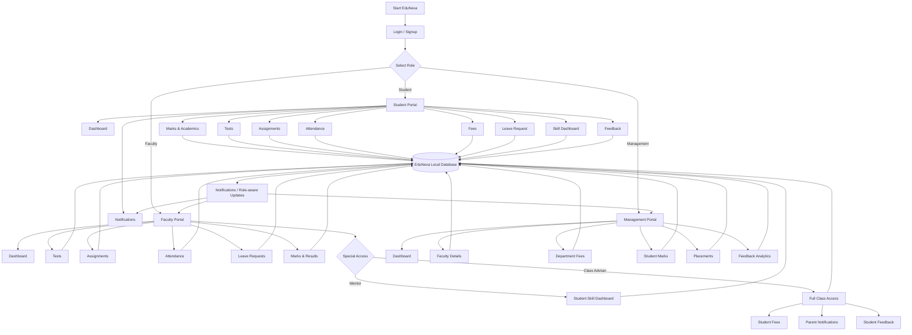

# EduNexa Frontend Flowchart

## Data flow
`User -> Role Authentication -> Role Navigation -> Module -> Local Database -> UI Refresh / Notifications`

The current frontend stores its demo data in browser `localStorage`, using the `edunexa_v4` database key.
