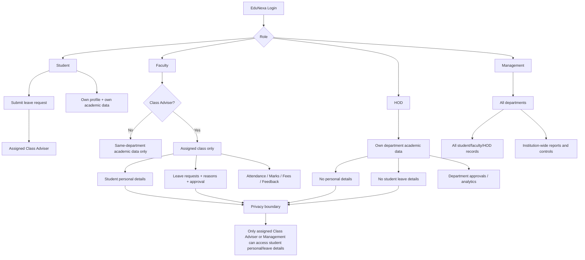

# EduNexa — Department + Class Adviser Privacy Flowchart

## Access rules

| Role | Student academic data | Student personal details | Leave details | Scope |
|---|---|---|---|---|
| Student | Own only | Own only | Own requests | Self |
| Faculty (non-adviser) | Yes | No | No | Same department |
| Class Adviser | Yes | Yes | Yes + approve/reject | Assigned class |
| HOD | Yes | No | No | Same department |
| Management | Yes | Yes | Yes | All departments |

### Important behavior
- A Class Adviser is additionally restricted by `classesHandled`; they do not automatically receive every student in the department.
- Student personal records include address, parent/guardian details, contacts, blood group, school history, 10th/12th marks and additional private details.
- Leave reason, dates, duration and review status are Class Adviser-only for staff, except Management.
- Faculty/HOD department dashboards can continue to show permitted academic information without exposing private profile fields.
- Existing EduNexa modules and features are retained; this change adds privacy boundaries rather than removing functionality.
