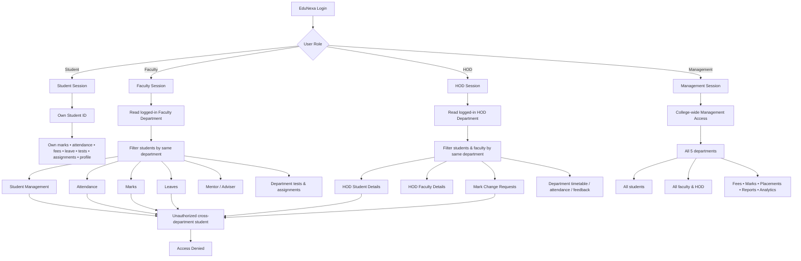

# EduNexa Department-Wise Access Flowchart

## Access rule

**Management → ALL departments**  
**Faculty → ONLY students/data from Faculty's department**  
**HOD → ONLY students/data from HOD's department**  
**Student → ONLY the logged-in student's own academic/profile data**



## Data flow

```text
Login
  ↓
Authenticated User
  ↓
Role + Department
  ↓
Department Access Layer
  ├── Student  → own record only
  ├── Faculty  → currentUser.department
  ├── HOD      → currentUser.department
  └── Management → no department restriction
  ↓
Existing EduNexa Features
  ↓
Filtered UI + filtered actions + access checks
  ↓
localStorage database
```

## Important implementation details

- Existing features are preserved; the change is an access/filter layer.
- `students()` is now role-aware.
- `getStudent()` refuses unauthorized cross-department student access.
- Faculty student records, attendance, marks, leave, mentor/adviser and academic lists are department-scoped.
- HOD student/faculty records, mark requests, feedback and faculty timetable/attendance are department-scoped.
- Management remains college-wide.
- New tests, assignments, leave records and mark requests store department metadata.
- The supplied 77-account structure is included: **50 students + 20 faculty + 5 HOD + 2 management** across **5 departments**.
