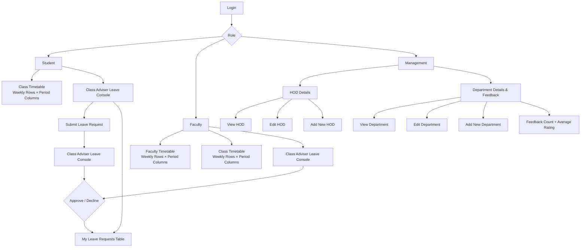

# EduNexa V3 Requested Feature Flowchart

## Final navigation

**Student**
- Class Timetable
- **Class Adviser Leave Console** — one section only; request form + My Leave Requests table

**Faculty**
- **Faculty Timetable** — weekly rows/columns
- **Class Timetable** — weekly rows/columns
- Class Adviser Leave Console (for advisers)

**Management**
- **HOD Details** — View / Edit / Add New HOD
- **Department Details & Feedback** — View / Edit / Add New Department + feedback analytics
- Removed the old **Management Views** group and separate management feedback entry.
