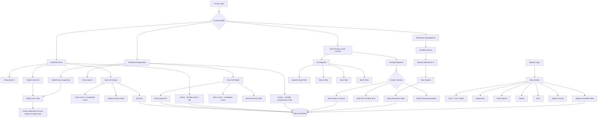

# EduNexa V13 – Requested Feature Flowchart

## Data flow summary

- **Tests/Assignments:** new records are saved to SQLite; only the latest three are displayed in the main Published list. Older records remain available through History.
- **Assessment activity:** students generate a `seen` record when they open/start a test or assignment; existing submissions are counted as completion/submission activity.
- **Notifications:** publishing an assessment creates notifications only for students assigned to the selected class. Leave decisions notify the requesting student.
- **Attendance:** daily attendance remains the existing source of truth. The new faculty view calculates each student's percentage and opens the existing daily attendance records.
- **Leave:** Accept/Decline updates the existing leave row instead of deleting it. The pending console hides reviewed requests, while All Requests exposes the complete history with filters.
- **Class Details:** the student page reads the assigned class hierarchy and class timetable from the same backend database.

## Compatibility rule

All changes are additive. Existing authentication, registration, marks, fees, feedback, placement, mentor, timetable editing, submissions, notifications, HOD and Management modules are retained.
